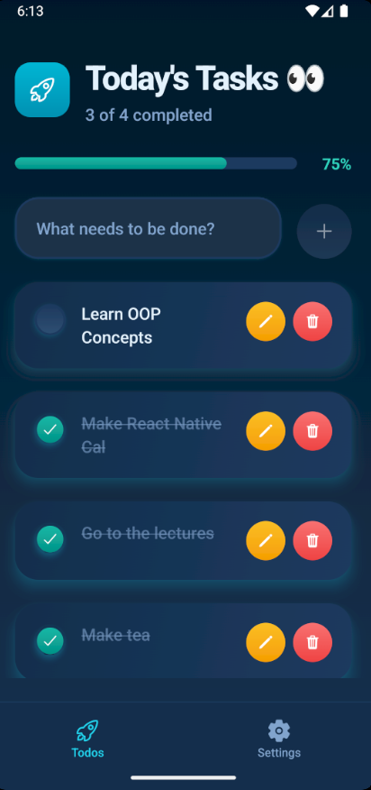
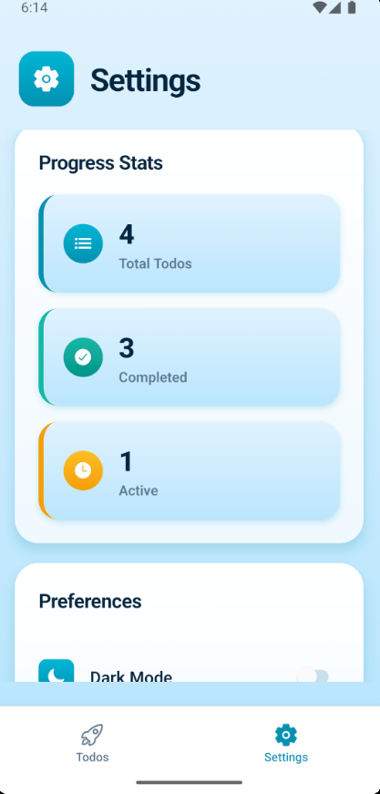

# 🚀 To-Do App

A beautiful, modern React Native todo application built with Expo, featuring a stunning Ocean Blue & Teal theme, real-time synchronization with Convex backend, and smooth animations.

## ✨ Features

- ✅ **Create, Edit, Delete Tasks** - Full CRUD operations for managing your todos
- 🎨 **Ocean Blue & Teal Theme** - Professional color scheme with light and dark mode support
- 🌓 **Dark Mode Toggle** - Seamless theme switching with persistent preferences
- 📊 **Progress Tracking** - Visual progress bar showing task completion
- 💾 **Real-time Sync** - Powered by Convex for instant data synchronization
- 🎯 **Task Statistics** - Track completed, active, and total tasks
- 📱 **Responsive Design** - Optimized for both iOS and Android
- ✨ **Smooth Animations** - Beautiful gradient effects and transitions
- 💎 **Modern UI/UX** - Rounded corners, shadows, and polished interactions

## 📸 Screenshots

<!-- Add your screenshots here -->
<div align="center">
  
  
  
</div>

## 🛠️ Tech Stack

- **Framework:** [React Native](https://reactnative.dev/) with [Expo](https://expo.dev/)
- **Language:** [TypeScript](https://www.typescriptlang.org/)
- **Backend:** [Convex](https://www.convex.dev/) - Real-time database
- **Navigation:** [Expo Router](https://docs.expo.dev/router/introduction/)
- **Icons:** [@expo/vector-icons](https://icons.expo.fyi/)
- **Gradients:** [expo-linear-gradient](https://docs.expo.dev/versions/latest/sdk/linear-gradient/)
- **Storage:** [@react-native-async-storage](https://react-native-async-storage.github.io/async-storage/)

## 🚀 Getting Started

### Prerequisites

- Node.js (v18 or higher)
- npm or yarn
- Expo Go app (for testing on physical devices)
- iOS Simulator or Android Emulator (optional)

### Installation

1. **Clone the repository**
   ```bash
   git clone https://github.com/ImalkaDilakshan99/To-Do-App_rn.git
   cd To-Do-App_rn
   ```

2. **Install dependencies**
   ```bash
   npm install
   ```

3. **Set up Convex**
   ```bash
   npx convex dev
   ```
   Follow the prompts to create a new Convex project and configure your backend.

4. **Start the development server**
   ```bash
   npx expo start
   ```

5. **Run the app**
   - **iOS Simulator:** Press `i` in the terminal
   - **Android Emulator:** Press `a` in the terminal
   - **Physical Device:** Scan the QR code with Expo Go app

## 📱 Available Scripts

```bash
npm start          # Start Expo development server
npm run android    # Run on Android emulator
npm run ios        # Run on iOS simulator
npm run web        # Run on web browser
npm run lint       # Run ESLint
```

## 📂 Project Structure

```
to-do_app/
├── app/                    # App screens and layouts
│   ├── (tabs)/            # Tab navigation screens
│   │   ├── index.tsx      # Home/Tasks screen
│   │   └── settings.tsx   # Settings screen
│   └── _layout.tsx        # Root layout
├── assets/                # Static assets
│   ├── images/           # Image files
│   └── styles/           # Style definitions
│       ├── home.styles.ts
│       └── settings.styles.ts
├── components/            # Reusable components
│   ├── Header.tsx
│   ├── TodoInput.tsx
│   ├── EmptyState.tsx
│   ├── LoadingSpinner.tsx
│   ├── ProgressStats.tsx
│   ├── Preferences.tsx
│   └── DangerZone.tsx
├── convex/               # Convex backend
│   ├── schema.ts         # Database schema
│   └── todos.ts          # Todo operations
├── hooks/                # Custom React hooks
│   └── useTheme.tsx      # Theme management
└── screenshots/          # App screenshots
```

## 🎨 Color Theme

### Light Mode
- **Primary:** Ocean Blue & Cyan (`#0891b2`, `#06b6d4`)
- **Success:** Teal (`#14b8a6`)
- **Background:** Light Blue (`#e8f4f8`)
- **Surface:** White (`#ffffff`)

### Dark Mode
- **Primary:** Bright Cyan (`#22d3ee`)
- **Success:** Bright Teal (`#2dd4bf`)
- **Background:** Deep Navy (`#0a1929`)
- **Surface:** Dark Blue (`#132f4c`)

## ⚙️ Configuration

### Convex Setup
The app uses Convex for real-time data synchronization. Make sure to:
1. Create a Convex account at [convex.dev](https://convex.dev)
2. Run `npx convex dev` to initialize your backend
3. The schema and functions are already defined in the `convex/` directory

### Theme Customization
Customize colors in [hooks/useTheme.tsx](hooks/useTheme.tsx):
- Modify `lightColors` for light mode
- Modify `darkColors` for dark mode

## 🤝 Contributing

Contributions are welcome! Please feel free to submit a Pull Request.

1. Fork the repository
2. Create your feature branch (`git checkout -b feature/AmazingFeature`)
3. Commit your changes (`git commit -m 'Add some AmazingFeature'`)
4. Push to the branch (`git push origin feature/AmazingFeature`)
5. Open a Pull Request

## 📄 License

This project is licensed under the MIT License - see the LICENSE file for details.

## 👨‍💻 Author

**Imalka Dilakshan**
- GitHub: [@ImalkaDilakshan99](https://github.com/ImalkaDilakshan99)

## 🙏 Acknowledgments

- Built with [Expo](https://expo.dev/)
- Backend powered by [Convex](https://www.convex.dev/)
- Icons from [@expo/vector-icons](https://icons.expo.fyi/)

---

<div align="center">
  Made with ❤️ and React Native
</div>
